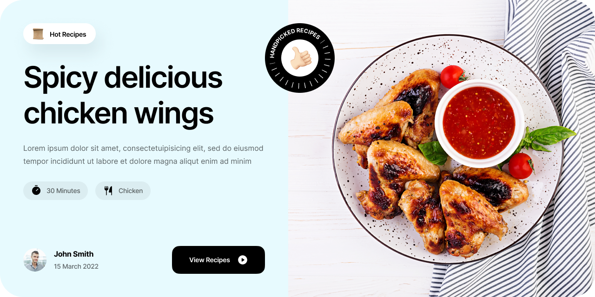

# Foodieland

Welcome to **Foodieland**, a website for food enthusiasts to discover, create, and share recipes. Foodieland is built with modern web technologies and offers a user-friendly interface for all your culinary needs.

## Table of Contents

- [Foodieland](#foodieland)
  - [Table of Contents](#table-of-contents)
  - [Features](#features)
  - [Technologies Used](#technologies-used)
  - [Design](#design)
  - [Usage](#usage)
  - [Contributing](#contributing)
  - [License](#license)
  - [Contact](#contact)

## Features

- Fetches and displays recipes from TheMealDB API and a custom backend
- User authentication: create an account, log in, update account details, delete account
- Recipe management: create, edit, delete your recipes
- Responsive design for a seamless experience on any device

## Technologies Used

- **Frontend**:
  - React
  - TypeScript
  - TailwindCSS
  - ShadCN UI
  - React Query
- **Backend**:
  - Appwrite (Backend as a Service)
- **APIs**:
  - TheMealDB API

## Design

The UI design is based on a template by Flowbase.co. You can view the original design [here](https://www.figma.com/design/DHkmtNG5zzwOldPBadb3Mv/Cooking-Template-%F0%9F%9F%A3-by-Flowbase.co-(Community)?m=auto&is-community-duplicate=1&fuid=1069695022516899260).

## Usage

- **Home Page**: Browse recipes fetched from TheMealDB and your backend.
- **Account Management**: Sign up, log in, update your account details, or delete your account.
- **Recipe Management**: Create, edit, or delete your recipes.

## Contributing

Contributions are welcome! Please fork the repository and create a pull request with your changes. You can also open issues for any bugs or feature requests.

## License

This project is licensed under the MIT License. Feel free to use it and modify it as you see fit.

## Contact

If you have any questions or feedback, please feel free to reach out.

---

Foodieland is a side project created for learning and fun. It is free to use and open to contributions.